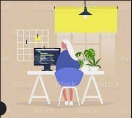
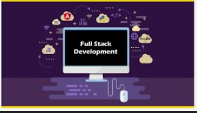

# PROYECTO 6: Portafolio

## **ÍNDICE**

* [1. Intro](#1-intro)
* [2. Portafolio](#2-portafolio)
* [3. Perfil General](#3-perfil)

## 1. Intro

El presente proyecto es para presentar un panorama de los proyectos realizados, los cuales usaron diferentes librerías como Javascript, React, Node, Mongo, etc.

La intención es mostrar de manera resumida el trabajo realizado durante el Bootcamp en UTEL. Estos proyectos serán mejorados y otros se enriquecerán con nuevos módulos.

****

## 2. Portafolio

A continuación se prsentan los links para algunos de los proyectos, así como los links a nivel profesional donde podrás encontrar mi información laboral.

## 3. Perfil

Me llamo Rosalba Fuentes actualmente estoy desarrollando proyectos enfocados a desarrollo web que incluyen el uso de diferentes librerías como Javascript, React & Mongo. Eestuve cursando un Bottcamp como Developer FuLL Stack.

Durante mi trayectoria he creado trabajos para crear información, diseños de páginas web, consultas de información, uso de GitHub, etc. 

URL hacia el repositorio
https://github.com/Rosalbafs

Adjunto mi portafolio de evidencias
https://github.com/Rosalbafs?tab=repositories

URL hacia el demo online (en caso de que exista)
https://rosalbafs.github.io/PROYECTO-2-CRUD.github.io/

Descripción de los proyectos

Se han desarrollado proyectos de todo tipo: salud, información de precios, calculadora, diseños para sitios web, mapa conceptual para una página de ecommerce, etc.

****

### GENERAL

Perfil profesional 

Rosalba Fuentes

México

Master Data Science Developer Web Full Stack Compliance Control Risk

Emprendedora, Maestra, Líder, Capacitadora. Capaz de trabajar en diferentes áreas para lanzar proyectos, implementar procesos con equipos globales: América, Europa y Asia.

Linkedin

https://www.linkedin.com/in/rose-f-soto-85629193/

GitHub

https://github.com/Rosalbafs

Habilidades / Conocimientos
Analítica, Orientación a Resultados, Comunicación Asertiva, Trabajo en Equipo, Pensamiento Digital, Agilidad de Aprendizaje, Resiliencia.

Stack IT: HTML, CSS, MongoDB, Express, React, Node, JavaScript, etc
